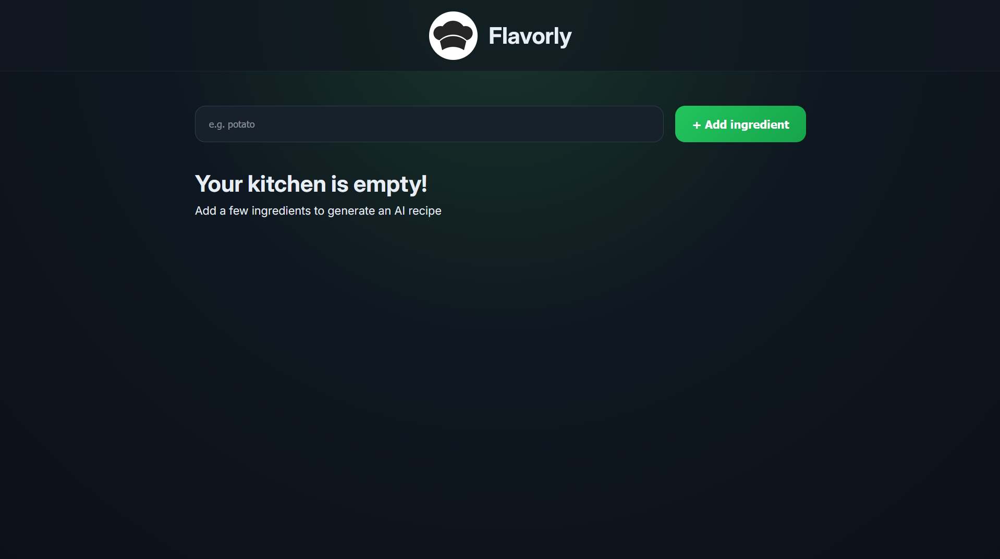
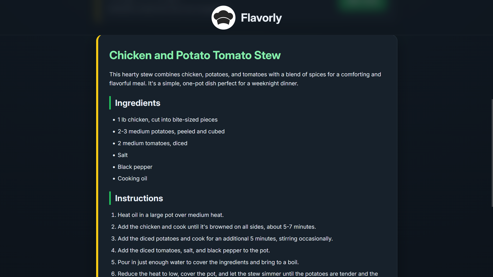
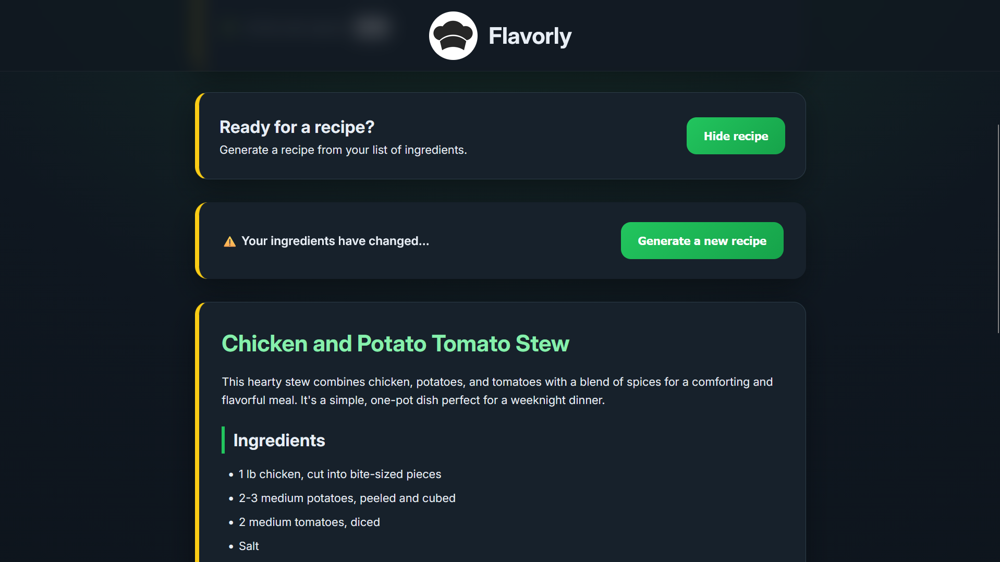
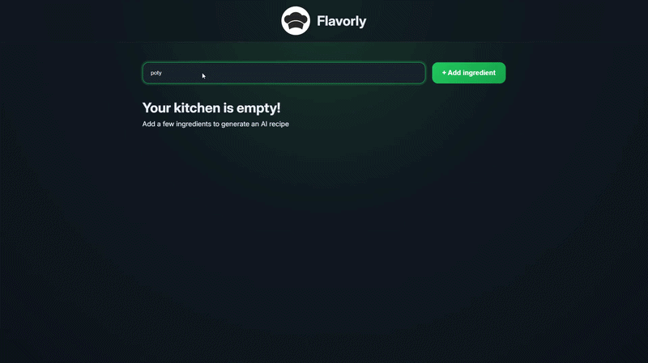

# 🍽️ Flavorly

An AI-powered recipe generator built with **React.js** that transforms your available ingredients into delicious recipes using the Groq API.

Flavorly focuses on providing a smooth and intuitive user experience while practicing modern React concepts such as component-based architecture, state management, conditional rendering, side effects, refs, asynchronous programming, and API integration.

---

## 📸 Preview

### Initial Screen



---

### AI Generated Recipe



---

### Recipe Outdated Warning



---

### Demo



---

# ✨ Features

- 🤖 AI-generated recipes using the Groq API
- 🥕 Add ingredients dynamically
- ❌ Remove ingredients from the list
- 🚫 Duplicate ingredient prevention
- 🧹 Empty input validation
- 📜 Recipes rendered beautifully using Markdown
- ⚡ Loading spinner while generating recipes
- 📍 Smooth auto-scroll to newly generated recipes
- ⚠️ Detects when ingredients change after recipe generation
- 🔄 Allows users to regenerate recipes for updated ingredients
- 👀 Users can continue viewing the previous recipe until they choose to regenerate
- 📱 Responsive modern UI
- 🎨 Smooth animations for recipes and warning messages

---

# 🛠️ Built With

- React.js
- JavaScript (ES6+)
- CSS
- HTML
- React Markdown
- Groq API

---

# 📚 React Concepts Practiced

This project helped me practice and understand:

- Functional Components
- JSX
- Props
- State Management using `useState`
- Conditional Rendering
- Event Handling
- Forms
- Controlled User Interactions
- Lists and Keys
- Component Composition
- Async/Await
- Fetch API
- API Integration
- Side Effects using `useEffect`
- DOM Manipulation using `useRef`
- Smooth Scrolling
- Loading States
- Component Communication through Props

---

# 🧠 Application Flow

```text
User adds ingredients
        │
        ▼
Ingredient list updates
        │
        ▼
Click "Get a Recipe"
        │
        ▼
Loading spinner appears
        │
        ▼
Recipe generated using Groq API
        │
        ▼
Automatically scroll to recipe
        │
        ▼
User changes ingredients
        │
        ▼
Recipe marked as outdated
        │
        ▼
User can either

• Continue reading old recipe
          OR
• Generate a new recipe
```

---

# 🚀 Installation

Clone the repository

```bash
git clone https://github.com/trike576/flavorly.git
```

Navigate into the project

```bash
cd flavorly
```

Install dependencies

```bash
npm install
```

Start the development server

```bash
npm run dev
```

---

## 🔑 Environment Variables

Create a `.env` file in the project root and add your Groq API key:

```env
VITE_GROQ_API_KEY=your_groq_api_key
```

Then start the development server:

```bash
npm install
npm run dev
```

# 📂 Project Structure

```
Flavorly/
│
├── src/
│   ├── components/
│   │   ├── Header.jsx
│   │   ├── IngredientsList.jsx
│   │   ├── RecipeGenerator.jsx
│   │   ├── Recipe.jsx
│   │   └── IngredientsChangedWarning.jsx
│   │
│   ├── services/
│   │   └── groq.js
│   │
│   ├── data/
│   │   └── initialIngredients.js
│   │
│   ├── Main.jsx
│   ├── App.jsx
│   └── style.css
│
├── public/
├── package.json
└── README.md
```

---

# 🎯 Future Improvements

- Save favorite recipes
- Recipe history
- Dark/Light theme toggle
- Ingredient categories
- Search ingredients
- Recipe sharing
- Copy recipe button
- Nutrition information
- Cooking time estimation
- Recipe difficulty indicator
- Framer Motion animations

---

# 📖 What I Learned

Building Flavorly strengthened my understanding of:

- Designing reusable React components
- Managing application state
- Thinking about UI/UX while building features
- Handling asynchronous API requests
- Managing loading and error states
- Working with React Hooks
- Building interactive interfaces with conditional rendering
- Creating responsive layouts with CSS
- Structuring React applications into reusable modules

---

# 👨‍💻 Author

**Kunal Kanse**

Engineering Student passionate about Web Development, React.js, JavaScript, and building practical projects while continuously improving problem-solving skills.

---

## ⭐ If you like this project, consider giving it a star!